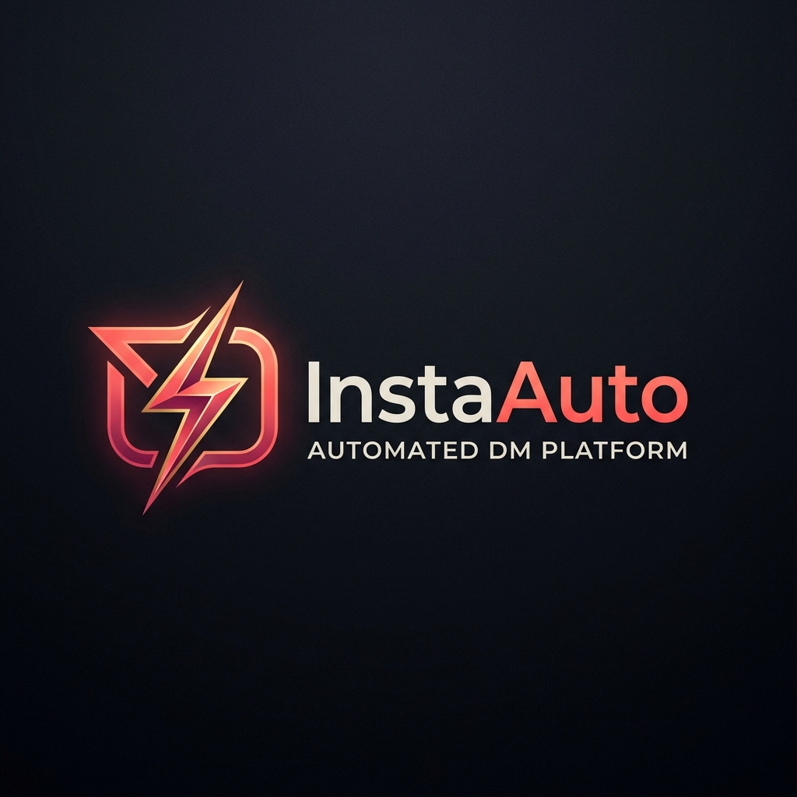
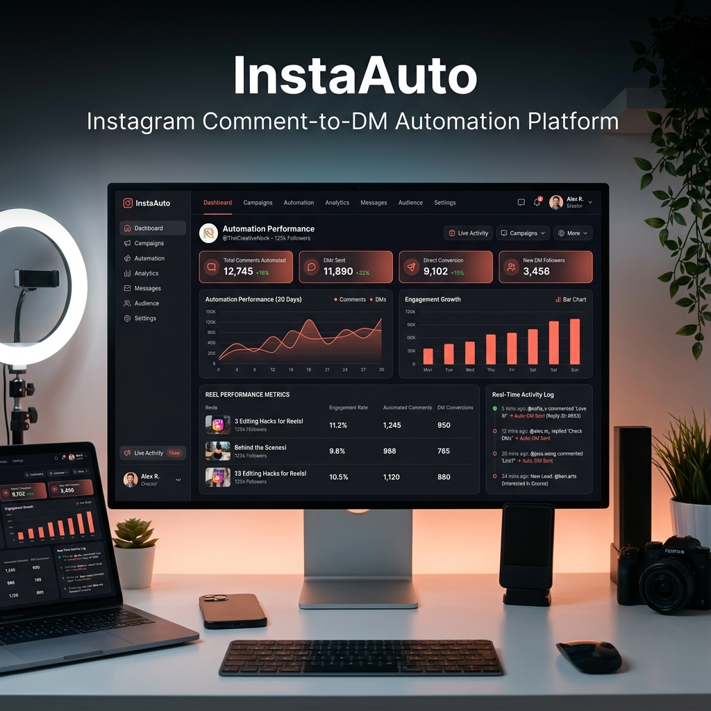
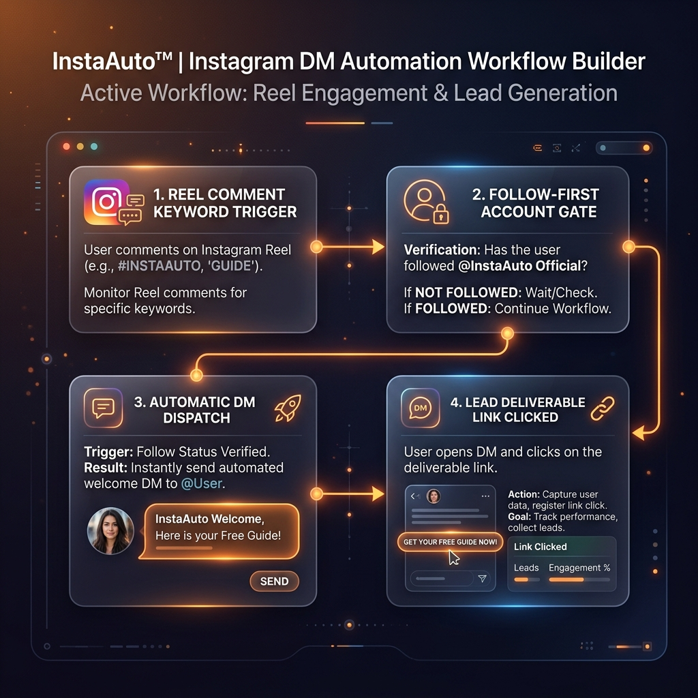
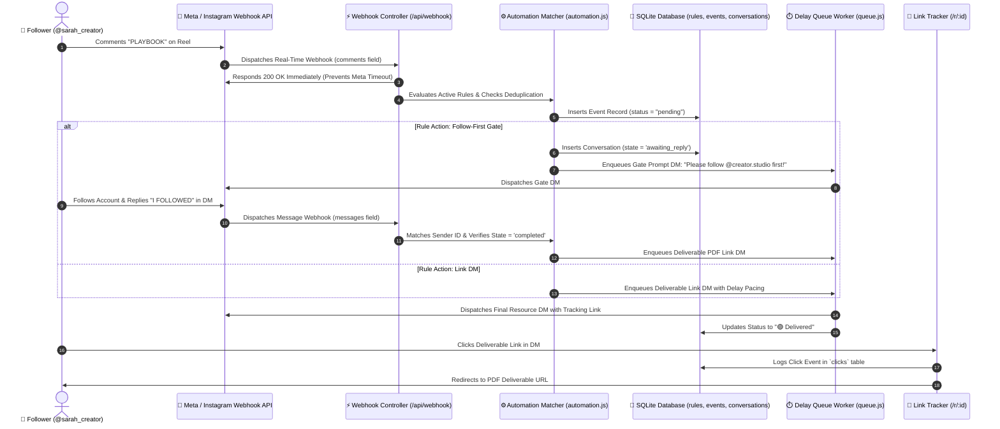

<p align="center">
  
</p>

<h1 align="center">⚡ InstaAuto — Instagram Comment-to-DM Automation Platform</h1>

<p align="center">
  <b>High-performance Meta Graph API automation platform for creators, agencies, and businesses.</b><br />
  Instantly convert Instagram Reel viewers into leads, enforce Follow-First verification gates, and dispatch automated DMs safely with rate-limit protection.
</p>

<p align="center">
  <a href="https://nodejs.org/"></a>
  <a href="https://expressjs.com/"></a>
  <a href="https://developers.facebook.com/docs/instagram-api/"></a>
  <a href="https://sqlite.org/"></a>
  <a href="https://vercel.com/"></a>
  <a href="https://render.com/"></a>
  <a href="LICENSE"></a>
</p>

---

## 📸 Dashboard Interface Overview

<p align="center">
  
</p>

---

## ✨ Key Features & Capabilities

### 🔐 1. Follow-First Verification Gate
Require followers to follow `@creator.studio` before unlocking deliverable PDF resource links.
- When a viewer comments a trigger keyword, InstaAuto dispatches a polite Follow prompt DM.
- Registers session state (`awaiting_reply`).
- Automatically verifies DM reply confirmation (*"I FOLLOWED"*, *"DONE"*, *"FOLLOWING YOU"*) and releases the resource link!

<p align="center">
  
</p>

### 🎯 2. Keyword Trigger Engine & Deduplication
- Support for comma-separated trigger keywords (e.g., `PLAYBOOK, PDF, GUIDE, LINK`).
- Case-insensitive regex matching with exact word boundary detection (`\bkeyword\b`).
- Comment-level and user-level deduplication to prevent duplicate DM spam per Reel post.

### ⏱️ 3. Anti-Spam Queue Worker & Pacing (250 DMs/hr Cap Protection)
- Enforces natural delay pacing (`delay_seconds`) before dispatching private replies and direct DMs.
- Rate-limit backoff engine protects account health against Meta spam flags.

### 🎯 4. Deliverable Link Click Telemetry
- Generates unique UUID tracking redirect links (`/r/:trackingId`).
- Logs timestamps, IP address, and user agents in the SQLite database.
- Marks activity log rows with **`🎯 Deliverable Link Clicked ✓`**.

### 🛡️ 5. Automated 60-Day Token Auto-Refresh Cron Engine
- Runs silently every 6 hours (`cron.schedule('0 */6 * * *')`).
- Calls Meta's `refresh_access_token` endpoint to extend long-lived access tokens for 60 days continuously.

### 📊 6. Reel Analytics & Monthly History Archival
- Filter by media item, sort by rank/conversion rate, and view top-performing Reels.
- Month-over-month archival ledger providing historical performance metrics across past campaign cycles.

### 📘 7. About & Meta Developer Handbook
- Built-in developer portal guide with 1-click links to Meta App Dashboard, Graph API Explorer, Access Token Debugger, copyable JSON webhook payloads, and interactive FAQ accordions.

---

## 🏗️ System Architecture & Workflow



---

## 🛠️ Local Installation & Setup

### Prerequisites
- **Node.js**: v18.0.0 or higher
- **npm**: v9.0.0 or higher

### Step 1: Clone Repository
```bash
git clone https://github.com/harshparmar2004/instagram-automation.git
cd instagram-automation
```

### Step 2: Install Dependencies
```bash
npm install
```

### Step 3: Configure Environment Variables
Copy `.env.example` to `.env`:
```bash
cp .env.example .env
```
Edit `.env` with your settings:
```env
PORT=3000
BASE_URL=http://localhost:3000
DASHBOARD_PASSWORD=your_secure_password
META_APP_ID=9876543210123
META_APP_SECRET=your_meta_app_secret
WEBHOOK_VERIFY_TOKEN=creator_verify_token_2026
```

### Step 4: Start the Application
```bash
# Production mode
npm start

# Development mode with auto-reload
npm run dev
```
Open **[http://localhost:3000](http://localhost:3000)** in your browser!

---

## 🚀 Production Deployment Options

InstaAuto supports both **Split Vercel + Render Deployment** and **Unified Render Web Service Deployment**.

### Option A: Split Deployment — Vercel (Frontend) + Render (Backend)

1. **Deploy Backend on Render**:
   - Create a Web Service on [Render](https://render.com) pointing to `harshparmar2004/instagram-automation`.
   - Build Command: `npm install` | Start Command: `node server.js`.
   - Note down your backend Render URL (`https://instaauto-backend.onrender.com`).

2. **Configure `vercel.json`**:
   - Update `vercel.json` rewrites with your Render URL:
   ```json
   {
     "rewrites": [
       { "source": "/api/(.*)", "destination": "https://instaauto-backend.onrender.com/api/$1" },
       { "source": "/webhook", "destination": "https://instaauto-backend.onrender.com/webhook" },
       { "source": "/r/(.*)", "destination": "https://instaauto-backend.onrender.com/r/$1" }
     ]
   }
   ```

3. **Deploy Frontend on Vercel**:
   - Import your repository on [Vercel](https://vercel.com) and deploy! Vercel automatically proxies `/api/*` and `/webhook` calls to Render.

---

### Option B: Unified Deployment on Render (Recommended ⭐)

1. Create a single Web Service on Render.
2. Render hosts `server.js`, serving both the static dashboard UI and real-time backend webhooks under a single HTTPS URL (`https://instaauto-engine.onrender.com`).

---

## 📱 Meta Developer App Go-Live Checklist

1. Log in to [developers.facebook.com](https://developers.facebook.com/apps) → Select your **Business App**.
2. Navigate to **Webhooks → Instagram**.
3. Set **Callback URL**: `https://your-backend-domain.com/api/webhook`.
4. Set **Verify Token**: Matching your `WEBHOOK_VERIFY_TOKEN`.
5. Click **Verify and Save**, then subscribe to `comments` and `messages`.
6. Under **App Roles → Instagram Testers**, add your Instagram handle to enable live comment webhooks!

---

## 👨‍💻 Author & License

Developed with ❤️ by **Harsh Parmar** ([@harshparmar2004](https://github.com/harshparmar2004)).

This project is licensed under the **MIT License** — see the [LICENSE](LICENSE) file for details.
